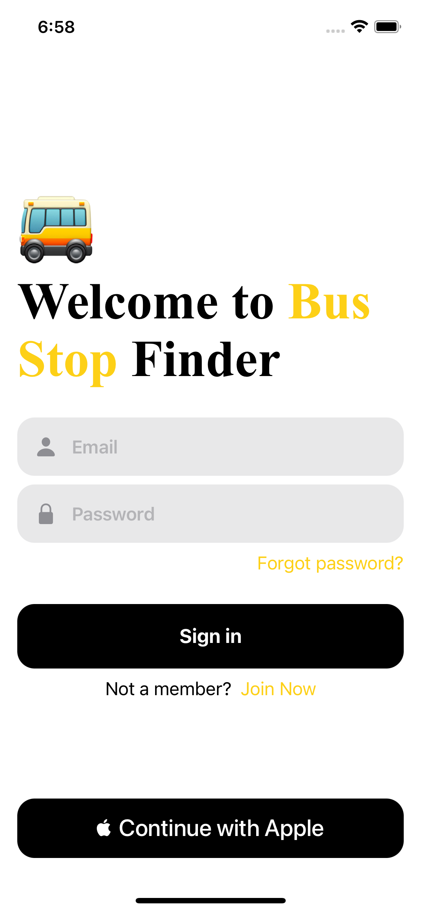
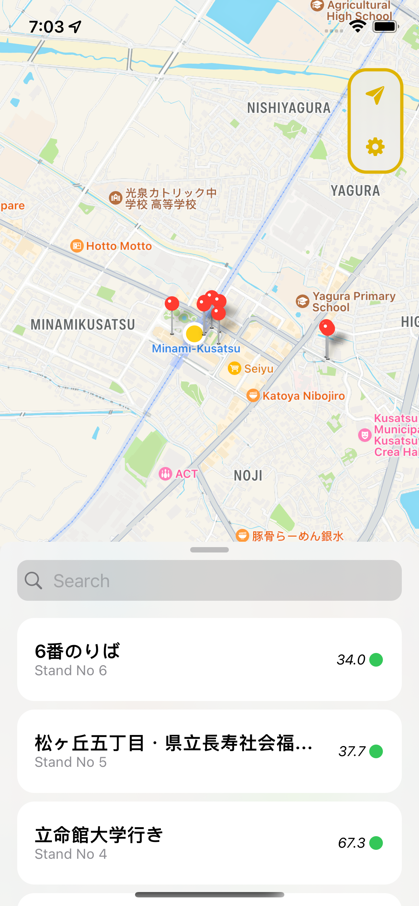
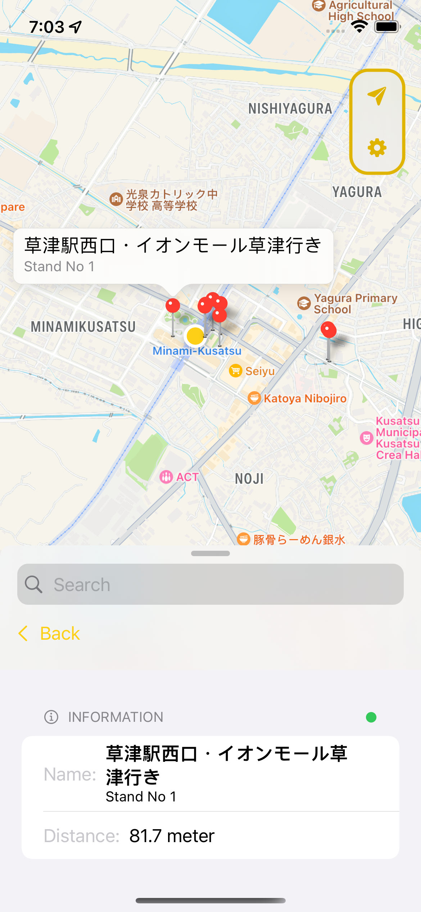
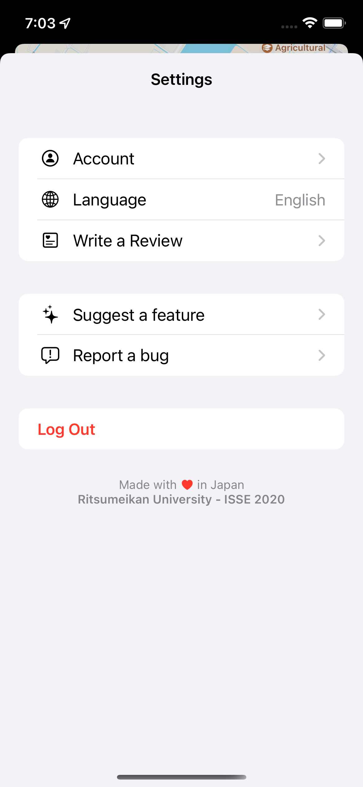

# Bus Stop Finder

The bus stop app is a simple app that allows you to find the nearest bus stop to your location and shows the bus stop's name, distance and longitude and latitude.

### 📱 The iOS/macOS app for finding bus stops

| Login  | Sign up   | Map    | Pins  | Settings  |
| ------------ | ------------ | ------------ | -------------- | ----------- |
|  |  |  |  |  |

### 🧙‍♂️ Features

* Uses Firebase for authentication, database and analytics
* Built for iOS, iPadOS and macOS
* Written in SwiftUI
* Dark mode support
* Localized in Japanese, Hindi and Indonesian
* iOS 14.0+
* License: [GPLv3](https://github.com/iarata/bus-stop-finder/LICENSE)

### 🤳 Download

App Store: Under review

### 🛠 Build our App

To build the App, please read the [SETUP.md](https://github.com/iarata/bus-stop-finder/blob/master/SETUP.md)

### 🇪🇺 Translate

The App is translated in English, Japanese, Hindi and Indonesian. If there is a translation you would like to contribute, please open an issue.

### 💡 Found a bug or have some ideas for improvement?

* 💬 Open a new issue on [Github](https://github.com/iarata/bus-stop-finder/issues/new) or send an email at mrex778 [at] yahoo.ca
* 📝 Write a detailed description of the issue or feature request
* 📌 Include screenshots if possible

### 📋 Start Contributing

Make sure you read [SETUP.md](https://github.com/iarata/bus-stop-finder/blob/master/SETUP.md) when you start working on this project. Basically: Fork this repository and contribute back using pull requests to the master branch.
